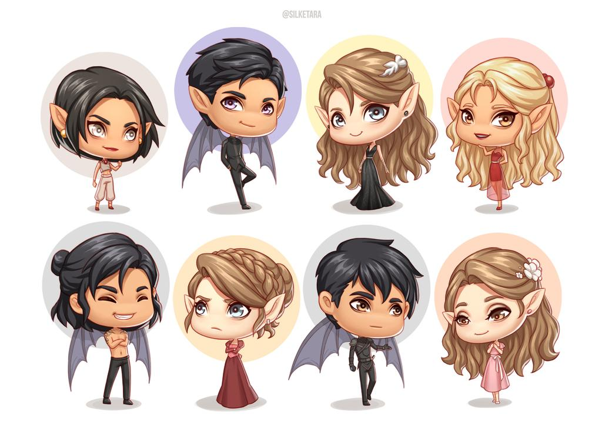

<h1>   ToTheStarsWhoListen </h1>
<h3>            And         </h3> 
<h1> TheDreamsThatAreAnswered </h1>

<h2> This site will inclue some short exerpts, moments we will remember forever, and hilarious interactions</h2>

<h3>This is a short list of the Inner Circle, and their titles</h3>
<h5>The second people in the list are their lovers.</h5>
<h4> <ul>
<li>Rhys & Feyre</li>
<ul>
<li>High Lord & Lady</li>	
</ul>
</li>
<li>Amren & Varian</li>
<ul>
<li>Justice & Balance</li>	
</ul>
</li>
<li>Mor & Andromache</li>
<ul>
<li>Truth & Treaty</li>	
</ul>
</li>
<li>Azriel & Elain</li>
<ul>
<li>Shadowsinger & Peace-Keeper</li>	
</ul>
</li>
<li>Cassian & Nesta</li>
<ul>
<li>General & Slayer</li>	
</ul>
</li>
</ul> </h4>
<h2>Here they are!</h2>

<h3><strong>Moments</strong></h3>
<h4>
<ul>
<li> "Hello Feyre darling,"</li>
<ul> 
<li>RHYS ARRIVES TO SAVE THE DAY</li>
</ul>
<li>"I killed them."</li>
<ul>
<li> Feyre's sparring with Cass, and starts reliving Under the Mountain, and it's so sad becasue she carries the guilt of their deaths forever. Cassian just gets it. He lets her keep punching.</li>
</ul>
</ul>
<h3> These moments either broke my heart, or made it whole again.</h3>	
</h4>

